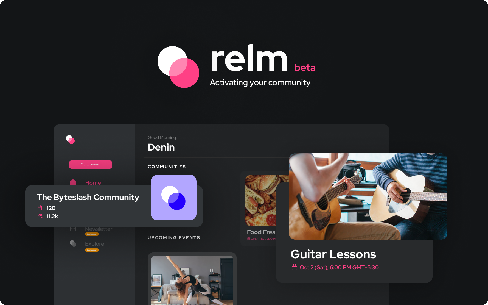
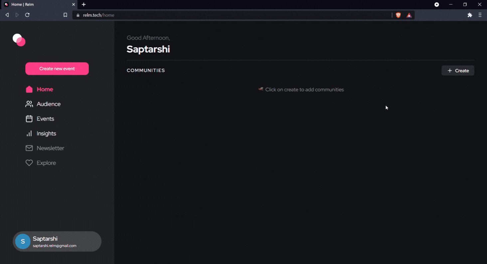
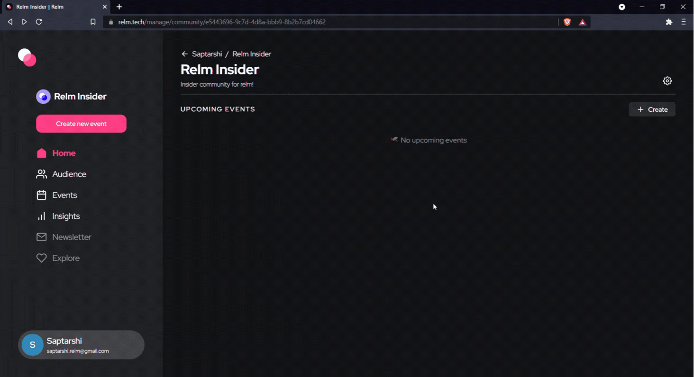
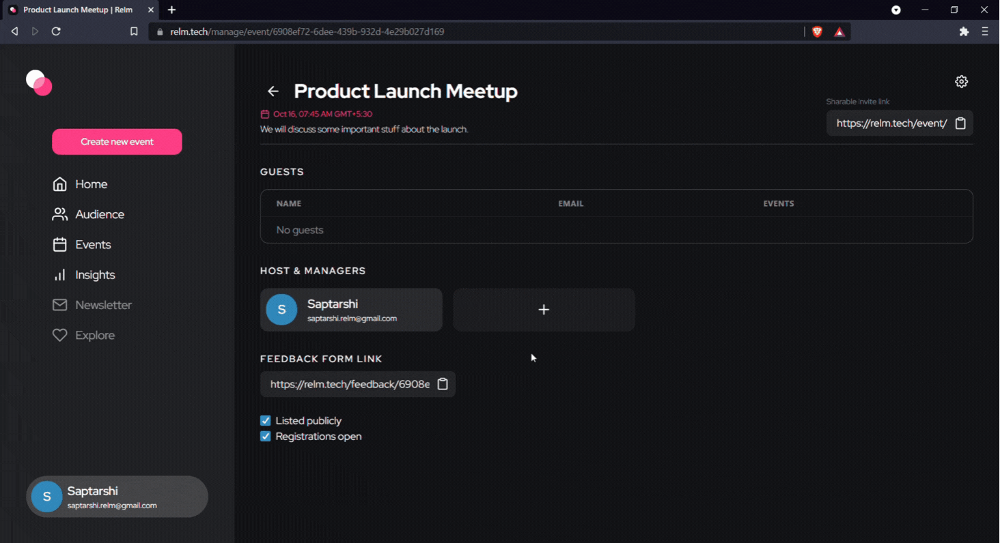
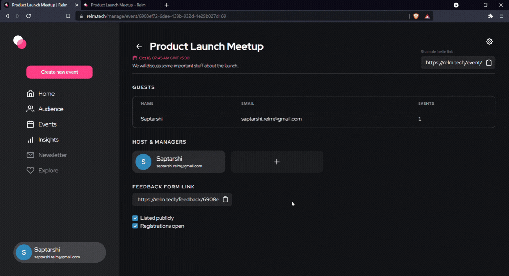
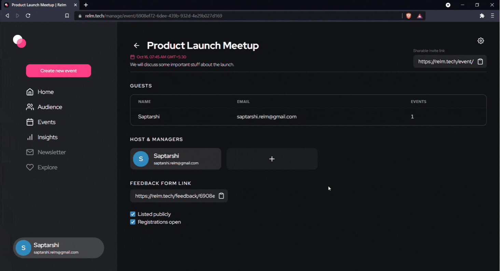
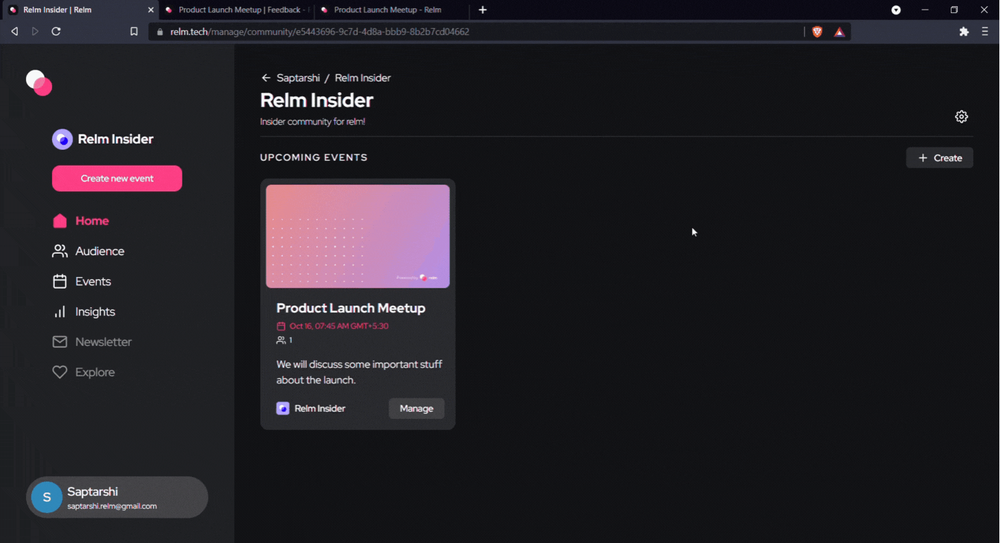

  
    
  
  
  

 

## 🚀 Relm (beta)

> Activating your community

It helps you making your community more engaging with events, analytics, newsletter and much more!

Check out **Relm** today - https://relm.tech

## 📯 Philosophy

Being a community is all fun with events, meetups and eveything we do together. Relm is the solution to ease up the flow of the communities by providing event management as our core feature, which comes along with insights which helps us being in touch and feed with the community.

That's why we built Relm, to help communities:

- 🧐 Stay engaged
- 📕 Get a close insight of members
- 📰 Discover wonders of being a community

## 🗂 Tech Stack

Below is a list of technologies we use at Relm.

## Team

- **Saptarshi**
  - [Twitter](https://twitter.com/imsaptarshiii)
  - [Github](https://github.com/imsaptarshi)
  - [Instagram](https://www.instagram.com/thesaptarshiii)
  - [Discord](https://discord.gg/VFfG7UTn5J)

## ✨Features along with walkthrough

- **Create Communities 🤗**

    

- **Create Events 📆**

    

- **Add/Remove Event Hosts 🧐**

    

- **Sharing Your Events 🤝**

    

- **Collecting your event insights 📬**

    

- **Close registrations for your event 🔐**

    

- **Update your event/community 🔼**

    

## ❓ How did I actually use Supabase in Relm

This was my first time using Supabase, though it has been pretty popular among my dev friends I never checked it out, but soon that day one of my friend posted about the Supabase hackathon and hearing about it I was really excited to participate in it and try out Supabase. Let me tell you, Supabase has really broke the roof of awesomeness.

- Firstly I used Supabase for user authentication with email(Magic link) and google auth
- And as planned I used Supabase wholly to structure my database

## License

[ISC](LICENSE) © 2021 Saptarshi Basu
